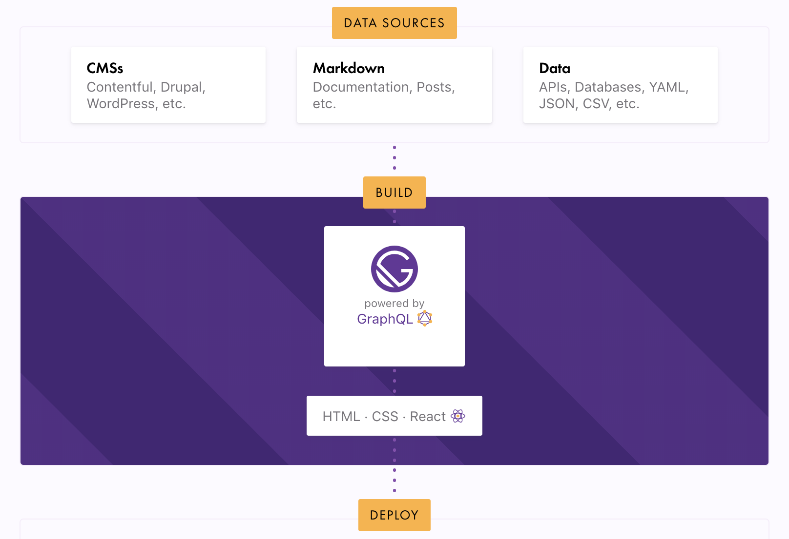
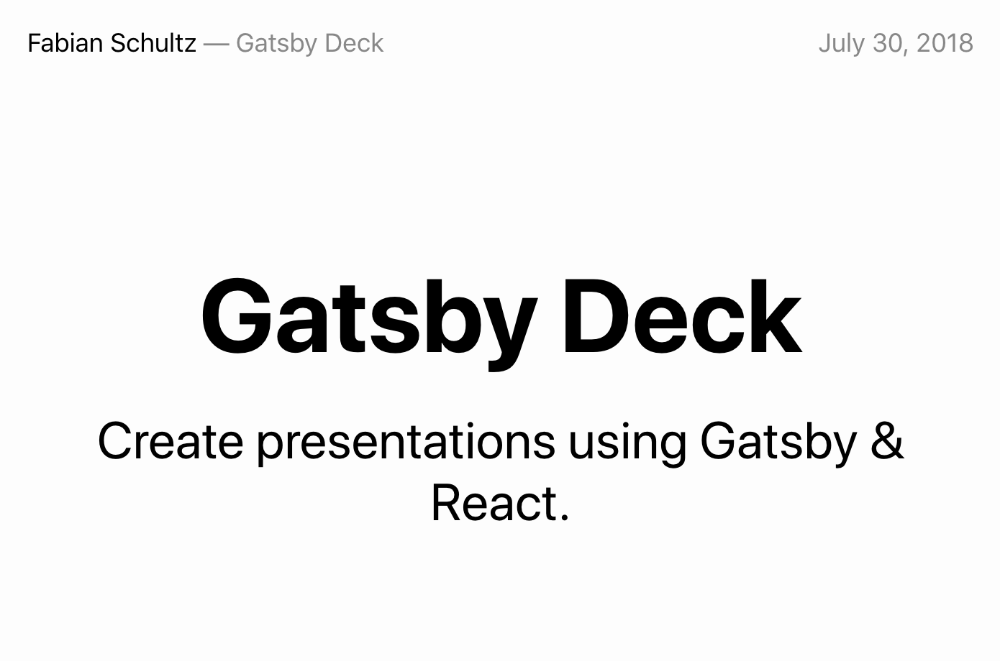

# gatsby-jsalpharetta

Presentation and Demo Project for https://www.meetup.com/JavaScriptAlpharetta/events/265017002/

## Overview



## Quick Start

### Software You Need

MacOS Specific Prerequisites:

```bash
# Xcode Command line tools
xcode-select --install

# Homebrew
/usr/bin/ruby -e "$(curl -fsSL https://raw.githubusercontent.com/Homebrew/install/master/install)"

# Actual Dependencies
brew install node
brew install git
```

Windows Specific Prerequisites:

```powershell
# Chocolatey
Set-ExecutionPolicy Bypass -Scope Process -Force; iwr https://chocolatey.org/install.ps1 -UseBasicParsing | iex

# Actual Dependencies
choco install nodejs
choco install git.install
```

Now, using a bash-compatible shell (e.g. Terminal on MacOS, Git Bash on Windows):

```bash
npm install -g gatsby-cli
gatsby new my-gatsby-site https://github.com/fabe/gatsby-starter-deck
cd my-gatsby-site
gatsby develop
```

Open [localhost:8000](http://localhost:8000/) and Voilà!



### Make a Change

* Edit `src/slides/01-intro.md`
* Experience the magic of hot reload!

### About Starters

Starters are boilerplate Gatsby sites.

* [Starters Documentation](https://www.gatsbyjs.org/docs/starters/)
* [List of Commuity-Provided Starters](https://www.gatsbyjs.org/starters/)

## A Tour of the Files

### Gatsby Project Core Files

#### `gatsby-config.js`

**Full Documentation:** [Gatsby Config API Docs](https://www.gatsbyjs.org/docs/gatsby-config/) and [Data in Gatsby Tutorial](https://www.gatsbyjs.org/tutorial/part-four/#data-in-gatsby)

##### `siteMetadata`

Common bits of data to be reused accross the site.

Example use:

```html
<Helmet
  title={`${site.siteMetadata.title} — {site.siteMetadata.name}`}
/>
```

##### `plugins`

[Plugins](https://www.gatsbyjs.org/docs/plugins/) are NodeJS packages that implement [Gatsby Node APIs](https://www.gatsbyjs.org/docs/node-apis/). Plugins can extend and modify virtually everything Gatsby does.

Typical usecases for plugins:

* Make external data or content available via GraphQL (files, databases, you-name-it)
* Transform data from various formats to JSON objects
* Inject third-party services (e.g. Google Analytics)

##### More

* [`polyfill`](https://www.gatsbyjs.org/docs/gatsby-config/#polyfill) - Exclude the default Promise polyfill.
* [`mapping`](https://www.gatsbyjs.org/docs/gatsby-config/#mapping-node-types) - Create foreign-key-like relationships between data sources
* [`proxy`](https://www.gatsbyjs.org/docs/gatsby-config/#proxy) - proxy unknown requests to the develop to a specified server

#### `gatsby-node.js`

Gatsby's "entry point" into generating your application. Export [Gatsby function](https://www.gatsbyjs.org/docs/node-apis/) implementations to generate your app.

### Project Structure

* `src/components` _conventionally_ keeps our React components.
* `src/pages` keeps the pre-defined pages of our app. Gatsby auto-generates a page per `js` file. Additional pages can be created using data and tempaltes.
* `src/layouts` _conventionally_ keeps our layout React components. [Layouts](https://www.gatsbyjs.org/tutorial/part-three/) are just React components that wrap other React components with common elements (e.g. header, footer, etc). Some folks keep their layouts in the `src/components` folder.
* `src/slides` _project specific_ content to define our slides - this becomes queryable data thanks to the `gatsby-source-filesystem` and `gatsby-transformer-remark` plug-ins.
* `src/templates`

#### Layouts vs. Templates

Template components are for page types e.g. blog posts, slides, products. Layout components are for components shared _across_ pages e.g. headers, footers, sidebars, etc.

_Generally_ templates use layouts, but layouts don't use templates.

## Just Enough React

## Just Enough GraphQL