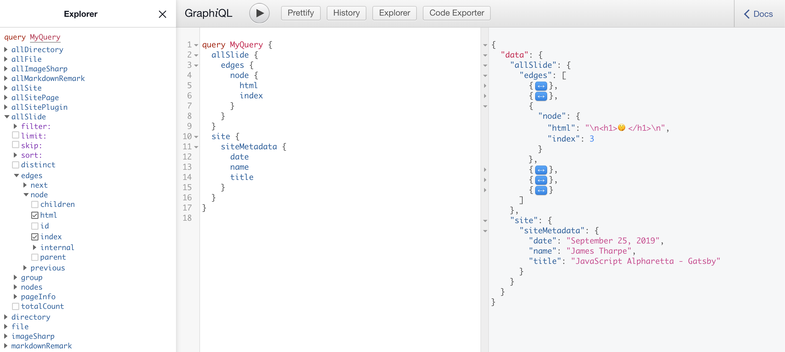

# Just Enough GraphQL

---

A GraphQL service definines types, then provides functions to resolve each field on each type. In Gatsby, plug-ins define "nodes", which Gatsby can resolve in-memory, or [custom resolvers](https://www.gatsbyjs.org/docs/node-apis/#createResolvers) for more advanced use cases.

---

We defined our type in `gatsby-node.js`:

```graphql
  type Slide implements Node {
    html: String
    index: Int
  }
```

---

Then loaded them into memory by calling `createNode` in `gatsby-node.js`:

```javascript
  createNode({
    id: createNodeId(`${node.id}_${index + 1} >>> Slide`),
    parent: node.id,
    children: [],
    internal: {
      type: `Slide`,
      contentDigest: createContentDigest(html),
    },
    html: html,
    index: index + 1,
  });
```

---

We can then query the data using GraphQL's JSON-like syntax:

```javascript
// Query
allSlide {
  edges { node { id, html, index } }
}
site {
  siteMetadata {
    date
    name
    title
  }
}
```

---

```javascript
// Output
{
  "data": {
    "allSlide": {
      "edges": [
        {
          "node": {
            "index": 1,
            "html": "..."
          }
        },
        // ...
      ]
    },
    "site": {
      "siteMetadata": {
        "date": "September 25, 2019",
        "name": "James Tharpe",
        "title": "JavaScript Alpharetta - Gatsby"
      }
    }
  }
}
```

---

```javascript
// Query
allSlide(filter: {index: {eq: 3}}) {
  edges {
    node {
      html
      index
    }
  }
}
```

---

```javascript
// Output
{
  "data": {
    "allSlide": {
      "edges": [
        {
          "node": {
            "html": "\n<h1>🤫</h1>\n",
            "index": 3
          }
        }
      ]
    }
  }
}
```

---

## The GraphiQL Explorer



---

## More GraphQL Resources

* [Introduction to GraphQL](https://graphql.org/learn/)
* [How to GraphQL](https://www.howtographql.com/)
* [Gatsby GraphQL Concepts](https://www.gatsbyjs.org/docs/graphql-concepts/)